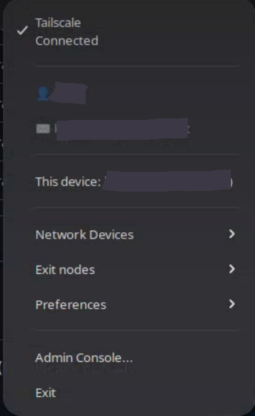

# Tailwrap

**Tailwrap** is a lightweight, Python-based system tray application for [Tailscale](https://tailscale.com) on Linux (specifically optimized for Fedora and GNOME).

It provides a fast and intuitive way to manage your Tailscale connection, switch Exit Nodes, and monitor your network devices without opening a browser or using the CLI.



## Features

- **Quick Connect/Disconnect**: Toggle Tailscale status with a single click.
- **Device Info**: See your current Tailscale IP and hostname.
- **Network Devices**: List all devices in your Tailnet with their status (Online/Offline) and tags.
- **IP Copying**: Click any device IP to copy it to your clipboard.
- **Exit Nodes**: Easily select and switch between Exit Nodes.
- **Preferences**: Manage DNS settings, subnets, and incoming connections.
- **Native Look**: Built with GTK (via PyGObject) to fit perfectly into the GNOME environment.

## Prerequisites

Before installing, ensure you have the following:

1. **Tailscale** installed and authenticated.
2. **GNOME Extension**: [AppIndicator and KStatusNotifierItem Support](https://extensions.gnome.org/extension/615/appindicator-support/) (required to see the tray icon on Fedora).
3. **System Dependencies** (for Fedora):

   ```bash
   sudo dnf install python3-devel gcc gobject-introspection-devel cairo-gobject-devel libappindicator-gtk3
   ```

## 🚀 Installation

Clone the repository and run the installer:

```bash
git clone https://github.com/kord1an/tailwrap.git
cd tailwrap
chmod +x install.sh
./install.sh
```

The installer will set up a virtual environment, install dependencies, and add Tailwrap to your applications menu and autostart.

## ⚙️ Configuration

To allow Tailwrap to toggle Tailscale without asking for `sudo` every time, set your user as a Tailscale operator:

```bash
sudo tailscale up --operator=$USER
```

## 🗑️ Uninstall Guide

To remove Tailwrap from your system, simply run:

```bash
chmod +x uninstall.sh
./uninstall.sh
```

## 📄 License

MIT
